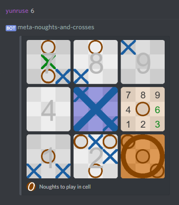

# Meta Noughts and Crosses

<a href="https://discordapp.com/oauth2/authorize?client_id=446046704039624715&scope=bot">

</a>
<a href="https://discord.gg/YRfvhP2">

</a>

Meta Noughts and Crosses (aka [Ultimate Tic-Tac-Toe](wiki)) is a tactical twist on the classic game. Make no mistake - it is easy to learn but difficult to master! MNAC can be played via the terminal, UI, or via a Discord bot.



## Features

- A core game class and renderer, freely available per [license] to reuse in your own project
- An ASCII terminal version, if you enjoy playing games in Vim or something
- A Tkinter program, playable by mouse or keyboard
- A Discord bot that works per-channel or via direct messages, as simple as `mnac/start` for each player, and with extensible support for different languages

## Installation and setup

First, grab the Python requirements - grab Python 3.5 or above and:

`pip3 install numpy Pillow discord.py toml`

You can exclude the last two if you don't want to run the Discord bot. If you do, register one with [Discord's API](API) if you haven't already, and remember the token.

If you have Linux, just:
```
cd path/to/place/bot
git clone https://github.com/yunruse/mnac
cd mnac
echo "token from Discord API" > config/token.txt
cp config/config_sample.toml config/config.toml
nano config/config.toml
python3 discord_bot.py

# do this if Linux gives you numpy errors
pip3 uninstall numpy
apt-get install python3-numpy
```
Otherwise:

1. [Download] and extract to the folder you want,
2. Create `config/token.txt` with the token,
3. Copy `config/config_sample.toml` to `config/config.toml` and edit as you see fit,
4. Run `discord_bot.py`.

#### Configuring the bot before use

To save time and processing power, the bot caches the URL of each render of the game, and stores them in a channel to avoid users deleting the cache. Create a private channel in a server you control, disable notifications on it, invite the bot with the link it shows you on startup, and register yourself as admin and that channel as cache channel by running `mnac/cache here`. From then on only you will be able to run `mnac/cache`. Delete the relevant lines in `config.toml` to undo that.

The bot will save data every few minutes. Run `mnac/cache purge` to clear cache or `mnac/help` for all non-admin commands.

## Update log
- 1.0: Initial release.

[wiki]: https://en.wikipedia.org/wiki/Ultimate_tic-tac-toe
[license]: license.txt
[download]: https://github.com/yunruse/MNAC/archive/master.zip
[API]: https://discordapp.com/developers/applications/me

## Legal

Copyright (c) Jack Dobson (yunru.se) 2018.

This work is licensed under a Creative Commons Attribution 4.0 International
license. In non-legal terms: do whatever you like, but credit me.

The full license is available here:
https://creativecommons.org/licenses/by/4.0/

